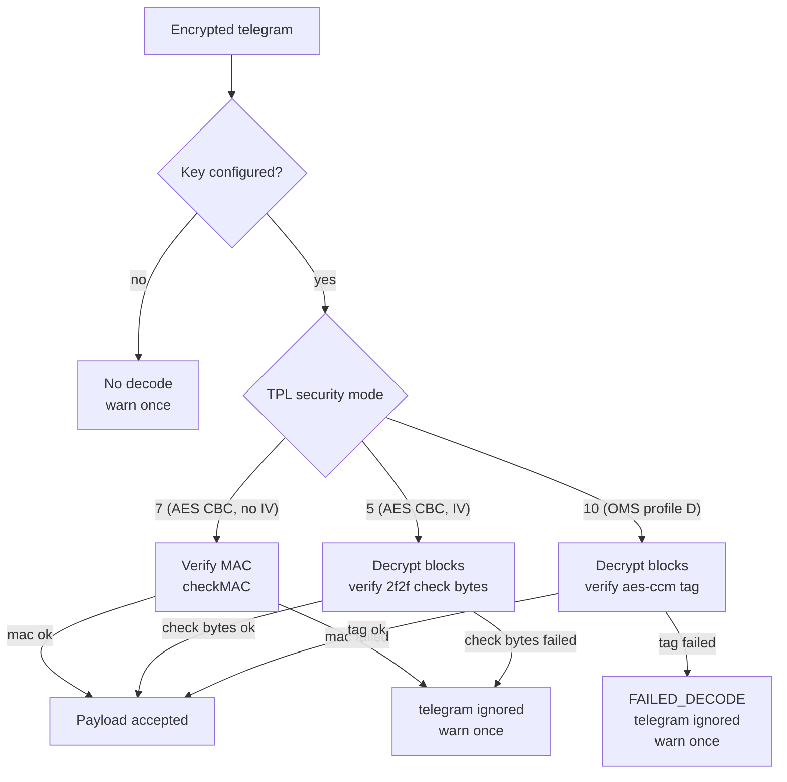

# Decode security (modes 5, 7 and 10)

Fail-closed behaviour with once-per-telegram warnings, decision 0002.

Mode 5 has no MAC: integrity is the 0x2f2f decrypt check bytes. Mode 7
is the variant that verifies the AFL MAC before decrypting (MAC key
from the KDF). Only mode 10 reports FAILED_DECODE, on tag failure. See
`Telegram::potentiallyDecrypt` in `src/wmbus.cc`.

Real telegrams for both paths live in `drivers/src/kamwater.xmq` and in
`tests/test_qwds_walkby_nokey.sh`.